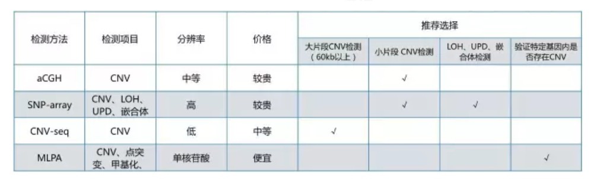

# CNV

## 1.CNV简介

    1.1 CNV（copy number variation),拷贝数变异，包括deletion和duplication两种，CNV在基因组中的存在形式主要有以下几种：两条同源染色体拷贝数同时出现缺失；1条同源染色体发生缺失，1条正常；一条同源染色体出现拷贝数重复，另一条正常；1条同源染色体出现缺失，另一条出现拷贝数重复；两条同源染色体同时出现拷贝数重复。
    1.2 一般的CNV事件长度范围1kb~几Mb级别。CNV占基因组长度12%左右，是人类基因多样性的重要组成部分，特别是大小在1kb~几kb较为常见，其在普通人群中的变异频率>1%,为人群多态性CNV。而较大的CNV大小在几百kb以上的则相对少见，通常为致病性的CNV，容易导致出生缺陷、神经性疾病、癌症等。因此，需要开发可靠的、准确的CNV检测方法。

## 2.检测方法比较

### 2.1 CMA（chromosome micro array）
    目前临床上CNV检测金标准，问题就是不能检测探针覆盖之外的CNV，优势就是成本低、速度快、对高密度SNP芯片来说分辨率也很高。

### 2.2 NGS
    1）如CNVseq，主要为低深度全基因组CNV分析，问题就是深度低、分辨率较低，虽然增加测序深度能提高分辨率但成本会增加，优势就是CNV检测范围为全基因组水平。
    2）除了WGS CNVseq外，为了节省成本，开始应用WES CNVseq和Panel CNVseq，但是WES和panel水平检测CNV存在很多问题，如PCR偏好性、捕获偏好性和模板的不连续性等问题。

### 2.3 实验方法
    如MLPA，该技术具有快速及特异性高的特点，但是不能对染色体组进行全局分析。

## 3.CNV检测方法

    目前对CNV进行检测的方法主要有aCGH, SNP-array, CNV-seq、MLPA

### 3.1 aCGH：基于芯片的比较基因组杂交（array-based comparative genomic hybridization）。

    原理：将等量的待测DNA和正常对照DNA分别用红色和绿色荧光染料标记，混合，然后与全基因组DNA芯片进行竞争性杂交。杂交后的芯片经激光扫描，比较每个点红光和绿光的发光强度。若红光过强，表明待测样本拷贝数复制；若红光较弱，表明待测样本拷贝数缺失；若红绿光均等，则表明待测样品拷贝数正常。

    应用：可以检测全基因组水平上的CNV。

    点评：aCGH的分辨率，取决于芯片中探针在全基因组中的密度和探针长度。安捷伦SurePrint G3 Human CGH Microarray 1×1M芯片中，探针间距约为2kb。因为来自一个点的荧光的光强变化，可能会带有一定的偶然性，所以，一般是看染色体空间位置上相邻的3个点（或者更多的点），如果这3个点的荧光比值，都发生同一个方向的偏离，就可以判断这一段有拷贝数变异的证据。基于这点考虑，按照3个点计算，aCGH的分辨率约为6kb。
### 3.2 SNP-array:
    
    简介：SNP（Single Nucleotide Polymorphisms，单核苷酸多态）是指在基因组水平上由单个核苷酸的变异所引起的DNA序列多态性而形成的遗传标记。SNP在人类基因组中广泛存在，平均约每500-1000个碱基对中就有1个SNP，人类30亿碱基中大约有300万个。
    
    原理：与aCGH采用的双杂交策略不同的是，SNP-array利用待测样本与芯片探针进行单杂交，通过比较不同样本信号的强度来确定每个位点的拷贝数。
    
    应用：SNP-array芯片的探针为SNP位点序列，可以提供SNP信息。除可检测CNV外，还可检测单亲二倍体(UPD)、杂合性缺失(LOH)和嵌合体。
    
    点评：SNP 芯片探针在全基因组上的的密度非常大，分辨率很高。但是这些探针在基因组中并非均衡分布，在一些重复序列和复杂的CNV 区域， SNP 密度是较小的，不能得到较为清晰的CNV 图谱。Affymetrix 公司和Illumina 公司在新一代芯片中增加一个非多态性的探针，将探针更好地定位在特定区域，提高图谱的清晰度。目前Affymetrix 公司的CytoScan HD芯片为探针密度最高的芯片，含有270万个探针，基因间探针间距平均为1kb。按照3个点计算，SNP-array的分辨率约为3kb。
### 3.3 CNV-seq：低深度全基因组测序

    原理：CNV-seq检测原理与aCGH相似。将等量的待测样本DNA和正常对照DNA建库测序后，分别与reference sequence进行对比。通过比较两个样本每个滑窗内比对reads数目的多少来确定每个位点的拷贝数。
    
    应用：可以检测全基因组水平上的大片段CNV。
    
    点评：贝瑞和康采用双盲实验设计，对染色体结构异常的样本进行检测，滑窗大小为20kb的情况下，CNV-seq和高密度SNP-array对于已知致病CNVs都能达到100%的检出[2]。与中等密度SNP-array相比，CNV-seq表现更优。鉴于CNV-seq价格较低，CNV-seq可以替代微阵列芯片用于大片段CNV检测。关于CNV-seq的分辨率取决于滑窗的大小。一般来讲，如果是低倍基因组测序，要使滑窗内的reads数目可信的话，所取的滑窗不可能太小。根据文章2描述，以20kb滑窗大小计算，按照3个点计算，CNV-seq的分辨率约为60kb。
### 3.4 MLPA:
    
    简介：MLPA(multiplex ligation-dependent probe amplication，多重连接依赖式探针扩增)于2002年由荷兰学者Dr.SchoutenJP等首先提出，是针对待检DNA靶序列进行定性和半定量分析的技术
    
    原理：在DNA靶序列的特定变异位点（如点突变）两侧设计一对MLPA探针。每条探针包含一段通用引物序列和一段特异性杂交序列。杂交序列与靶序列杂交后，使用连接酶将两部分探针连接成一条核苷酸单链，再使用通用引物进行PCR扩增。通过比较待测DNA与正常对照DNA的PCR产物量，来确定待测样本DNA靶序列的拷贝数。值得注意的是，连接酶很挑剔，只有在检测位点处探针与靶序列完美互补配对的情况下，连接酶才能将两部分探针顺利连接成单链进行后续扩增。如果检测位点存在甲基化、点突变、CNV，则探针连接失败，不能进行后续PCR扩增。
    
    应用：验证高度怀疑的特定基因中的点突变、甲基化、CNV。

    点评：该技术具有快速及特异性高的特点，但是不能对染色体组进行全局分析。单一反应管内可以同时检测40个不同的核苷酸序列的拷贝数变化。
    
## 4.总结
   
   
   

## 5.参考链接和文献

    https://mp.weixin.qq.com/s/bEjTJyfoW2tCB09UsyOXcA
    [2].Zhu X, Li J, Ru T, et al. Identification of copy number variations associated with congenital heart disease by chromosomal microarray analysis and next generation sequencing.[J]. Prenatal Diagnosis,2016, 36(4):321–327.
    
