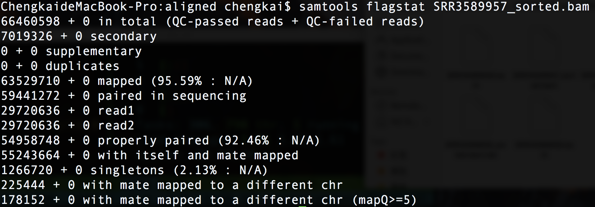

# samtools学习计划

## 1.samtools 基本参数

## 2.samtools flags

    total：分析的总reads数（bam文件所有行数）
    mapped：比对上的reads数（总体比对率）
    paired in sequencing：成对的reads总数
    read1：属于reads1的reads数量
    read2：属于reads2的reads数量
    properly paired：正确配对的reads数量
    with itself and mate mapped：一对reads均比对上的reads数
    singletons：只有单条reads比对上的reads数
    以上计数均以reads条数计，一对reads计为两条。

## 3.samtools cigar

## 4.samtools tags 

## 5.samtools source code 
